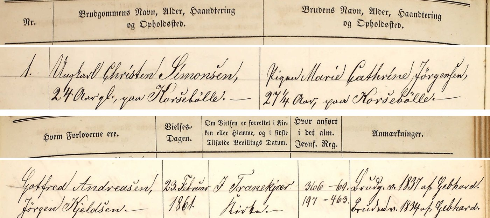
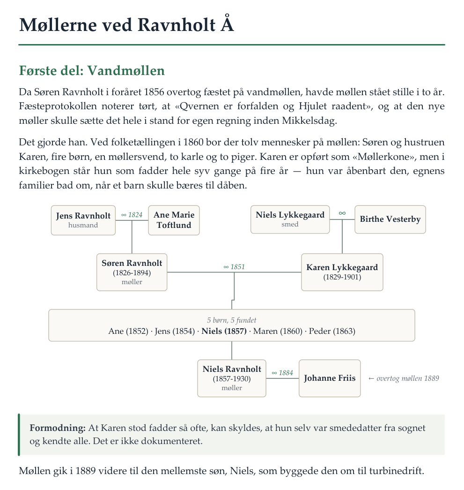

# webtrees + AI — dansk slægtsforskning med en AI-assistent

Et arbejdsrum til slægtsforskning, hvor en AI-assistent i terminalen — fx
[Claude Code](https://claude.com/claude-code), Codex eller Gemini CLI — både
**læser i de danske arkiver** og **skriver fundene ind i dit eget slægtstræ** i
[webtrees](https://webtrees.net), med kilde, afskrift og scanning på hver oplysning.

## Sådan ser det ud

**Fra håndskrift …** Der findes ingen tekstgenkendelse af de danske kirkebøger. Assistenten
henter opslaget fra Arkivalieronline, klipper indførslen ud og læser den selv:



*Tranekær Sogn (Langeland), kirkebog 1856-1891, viede 1861 nr. 1. Kilde: Rigsarkivet,
Arkivalieronline.*

| Felt | Afskrift |
|---|---|
| Brudgom | Ungkarl Christen Simonsen, 24 Aar gl., paa Korsebølle |
| Brud | Pigen Marie Cathrine Jørgensen, 27¼ Aar, paa Korsebølle |
| Forlovere | Gotfred Andreasen, Jørgen Kjeldsen |
| Vielsesdag | 23. Februar 1861, i Tranekjær Kirke |
| Anmærkninger | Brudg. v[accineret] 1837 af Gebhard. Bruden v. 1834 af Gebhard. |

**… til slægtstræ.** Fundet beskrives som ét job, som klienten tørkører og viser, før noget
sendes til webtrees. Vielsen bliver fx til:

```
1 MARR
2 DATE 23 FEB 1861
2 PLAC Tranekær, Langelands Nørre, Svendborg, Danmark
2 SOUR @S1@
3 PAGE Viede 1861 nr. 1
3 NOTE Afskrift læst fra scanningen: «Ungkarl Christen Simonsen, 24 Aar gl., …»
```

Scanningen hæftes på kilden, så den følger med, hver gang kilden citeres.

**… og til en bog.** `arkiv/mdpdf.py` sætter slægtsfortællingen som PDF, med tegnede
slægtstavler og dokumenteret tekst holdt adskilt fra formodninger (personerne her er
opdigtede):

<p align="center"></p>

Det består af tre dele:

| Del | Hvad det er |
|---|---|
| **webtrees i Docker** | `docker-compose.yml` og `INSTALL-DA.md`: webtrees + MariaDB på en NAS eller en hjemmeserver, eventuelt nået over Tailscale. |
| **Skrivevejen ind i træet** | `webtrees_klient.py`. webtrees har intet API, så klienten logger ind som en almindelig redaktør og sender de samme formularer som browseren. Et helt fund beskrives som ét *job* i JSON (`poster/`), og det kan altid tørkøres først. |
| **Læsevejen ud af arkiverne** | Omkring 120 små scripts i `arkiv/` til Arkivalieronline (kirkebøger, folketællinger), Dansk Demografisk Database, Mediestream, arkiv.dk, dødsregistret, kirkegårdsregistre, Københavns Stadsarkiv, Kraks Vejviser, Riksarkivet, Find a Grave m.fl. `arkiv/KILDER-ONLINE.md` beskriver, hvad der kan hentes maskinelt, og hvad der ikke kan. |

Oven på dem ligger metoden, skrevet til en hvilken som helst AI-assistent:

- **`AGENTS.md`**: projektets regler. De fleste assistenter læser filen automatisk.
- **`METODE.md`**: søgemetode, kildekritik og webtrees-fælder.
- **`.claude/skills/dansk-slaegtsforskning/`**: den samme metode som selvstændig skill.
- **`.claude/skills/slaegtsbog/`**: skriv en slægtsfortælling og sæt den som bog-PDF med tegnede slægtstavler (`arkiv/mdpdf.py`).

Alt er skrevet på dansk.

## Hvilken AI-assistent?

| Assistent | Hvad den læser |
|---|---|
| **Claude Code** | `CLAUDE.md`, som henviser til `AGENTS.md`. Metoden findes også som underagenten `slaegtsforsker`, og de to skills findes automatisk. |
| **Codex**, Cursor, GitHub Copilot m.fl. | `AGENTS.md` direkte. |
| **Gemini CLI** | `GEMINI.md`, som henviser til `AGENTS.md`. |
| Andre | Bed den læse `AGENTS.md` og `METODE.md`, før den går i gang. |

Skills-formatet (`SKILL.md`) er åbent, men hvor hvert værktøj leder efter skills, er
forskelligt. Finder dit værktøj dem ikke af sig selv, så peg det på mappen.

**Assistenten skal kunne tre ting:**

1. **Se billeder og læse håndskrift.** Der findes ingen tekstgenkendelse af kirkebøgerne;
   hele metoden hviler på, at assistenten selv læser gotisk håndskrift fra scanningerne. Små
   lokale modeller kan det sjældent godt nok. **Prøv din model af på en side, du selv kan
   læse, før du stoler på dens afskrifter.**
2. **Køre kommandoer og læse filer**, altså arbejde som agent i terminalen og ikke kun chatte.
3. **Følge reglen om at tørkøre først og spørge, før den skriver i træet.** Klientens
   `--dry-run` og dens manglende slettefunktion beskytter træet uanset assistent, men resten
   afhænger af, at assistenten overholder `AGENTS.md`.

**Valgfrit: FamilySearch.** FamilySearch kræver login og blokerer scripts. Vil du bruge det,
så log selv ind i din browser. En assistent, der kan arbejde i en browserfane, kan derefter
søge i den fane. Den ser aldrig dit kodeord. Metoden står i `METODE.md`.

## Kom i gang

**1. Installér webtrees.** Følg `INSTALL-DA.md`. **Skift de to kodeord i `docker-compose.yml`**,
før du starter containerne første gang, og ret `BASE_URL`, så den passer til din adresse.

**2. Opret en bruger til AI-assistenten** i webtrees, fx `ai`, med rollen *redaktør* på dit træ.
Giv den aldrig administratorrettigheder.

**3. Læg loginfilen uden for projektmappen.** Kopiér `login.eksempel.json` til
`%USERPROFILE%\.webtrees\login.json` (på Mac/Linux `~/.webtrees/login.json`), og udfyld den.
Assistenten må aldrig selv åbne filen; det gør kun klienten. Klienten nægter at læse loginfilen fra
projektmappen.

**4. Installér Python 3.10+ og afhængighederne:**

```
pip install -r requirements.txt
```

**5. Opret dine lokale arbejdsfiler** ud fra skabelonerne. `.gitignore` holder dem ude af git:

```
copy arkiv\README-DA.skabelon.md arkiv\README-DA.md
copy GOER-MANUELT.skabelon.md GOER-MANUELT.md
copy SLET-MANUELT.skabelon.md SLET-MANUELT.md
copy webtrees-steder.eksempel.csv webtrees-steder.csv
```

**6. Sæt to miljøvariabler** (valgfrit, men anbefalet):

| Variabel | Betydning | Standard |
|---|---|---|
| `WEBTREES_MEDIA` | webtrees' mediemappe, som scripts og PDF-sætning kan se (fx over SMB) | `//NAS/docker/webtrees/data/media` |
| `SLAEGT_ARBEJDSMAPPE` | arbejdsmappe til `facit.json`, kontaktark og andre mellemresultater | systemets temp-mappe |

**7. Prøv forbindelsen:**

```
python webtrees_klient.py --check
python webtrees_klient.py --dry-run poster\eksempel.json
```

**8. Åbn mappen i din AI-assistent**, og bed den om at finde nogen: *"Find min tipoldefar Anders
Eksempelsen, født omkring 1850 i Give sogn"*. Agenten søger, viser dig tørkørslen og skriver
først i træet, når du har sagt ja.

**9. Så får du det rigtig stærke: lad AI'en udvide træet selv.** Giv den et udgangspunkt,
og sæt den derefter til at søge videre ud fra det, der allerede står i træet.

*Læg udgangspunktet ind.* Det kan du gøre i hånden i webtrees, men det er nemmest at bede
assistenten om det:

> *"Opret mig, mine forældre og mine fire bedsteforældre i træet. Jeg hedder …, født …
> i …. Min far …, min mor …. Mine bedsteforældre på fars side …"*

Assistenten skriver det som et job og viser dig tørkørslen, før noget sendes. Jo flere
datoer og sogne du kan give, jo bedre. Dåbsattester, dødsannoncer og gamle breve kan du
give den som billeder.

*Sæt den i gang, og lad den arbejde selv.* Bed den læse træet, vælge, hvor den skal søge
videre, og arbejde **selvstændigt**. Så spørger den ikke for hvert fund:

> *"Arbejd selvstændigt de næste par timer. Læs træet, find de aner, der mangler forældre,
> og søg efter deres dåb i kirkebøgerne. Begynd med dem, hvor vi kender sognet. Skriv de
> sikre fund direkte i træet, og læg resten på listen til godkendelse."*

> *"Arbejd dig selvstændigt bagud i min mormors linje, én generation ad gangen, så langt
> kirkebøgerne rækker."*

> *"Find selvstændigt dødsdato og gravsted for alle i træet, der er født før 1920 og ikke
> har en dødsdato."*

> *"Gennemgå noterne i træet og tag fat i de åbne spor."*

**Selvstændig betyder ikke ukritisk.** Reglerne i `AGENTS.md` bestemmer, hvad assistenten
må skrive uden at spørge. Den må kun **tilføje**, og kun når den selv har set scanningen af
en kirkebog, folketælling eller lignende, læsningen er sikker, og mindst to kendetegn ud
over navnet stemmer med træet, fx forældrenes navne og fødestedet. Alt, der ikke er sikkert,
havner i stedet i `TIL-GODKENDELSE.md` med kilde og begrundelse. Det gælder sandsynlige
identifikationer, kilder, der modsiger træet, og mulige dubletter. Rettelser af det, der
allerede står i træet, spørger den altid om. Og den kan ikke slette noget.

Undervejs henter den hele træet med `arkiv/facit.py`, ser med `arkiv/bogdata.py <xref>`,
hvilke pladser i anetavlen der er tomme, og bruger `arkiv/notetjek.py` til at finde de spor,
noterne selv peger på. Hvert fund og hvert negative resultat skrives i journalen
(`arkiv/README-DA.md`), så næste søgning begynder, hvor den forrige slap. Til sidst kører den
kontrollerne og giver dig en rapport: hvad der er oprettet, hvad der venter på dig, og hvad
der blev søgt forgæves.

**Så den ikke går i stå:** De fleste AI-assistenter spørger om lov, før de kører en kommando.
Til lange kørsler skal du i assistentens indstillinger give den lov til at køre `python` i
projektmappen uden at spørge. Se dens dokumentation om tilladelser eller *approval modes*.
Giv den ikke mere end det, opgaven kræver.

**Godt at vide:** Kirkebøger før ca. 1814 er sværere at læse og mere spredte, og nyere
kirkebøger (typisk efter ca. 1960-1970) er ikke frit tilgængelige. Den bedste fremdrift får
du i 1800-tallet. Kig fundene igennem i webtrees bagefter, og kontrollér en gang imellem en
afskrift mod scanningen. Assistenten kan læse forkert, og den ved det.

**10. Giv den adgang til kilder bag login (valgfrit).** Nogle af de bedste kilder kræver
abonnement eller login, fx Politikens og andre avisers arkiver (dødsannoncer, nekrologer),
Nordjyskes avisarkiv, FamilySearch, Ancestry og MyHeritage. Sådan gør du:

1. Log selv ind på siden i din egen browser, med dit eget abonnement.
2. Brug en assistent, der kan arbejde i en browserfane, fx Claude med browserudvidelsen
   *Claude in Chrome*, eller et tilsvarende værktøj til din assistent.
3. Bed den søge dér: *"Jeg er logget ind på Politikens arkiv i Chrome. Søg efter
   dødsannoncer for dem i træet, der døde i København efter 1950."*

Assistenten ser aldrig dit kodeord, opretter ingen konti og kommer aldrig uden om en
CAPTCHA eller en betalingsmur. Den holder sig inden for abonnementets vilkår: opslag til
din egen slægtsforskning, lavt tempo og ingen massehentning. Udløber sessionen, beder den
dig logge ind igen. `arkiv/KILDER-ONLINE.md` beskriver, hvad hver kilde kan.

## Dine data bliver hos dig

Repoet indeholder **kun værktøj og metode**. Dit træ, dine jobfiler, din arkivjournal, dine
slægtshistorier, hentede billeder og loginfilen er udelukket i `.gitignore`. Se filen, før du
tilføjer noget nyt.

## Licens

MIT. Se `LICENSE`. webtrees selv er GPL og indgår ikke i repoet; det hentes som
Docker-image.
